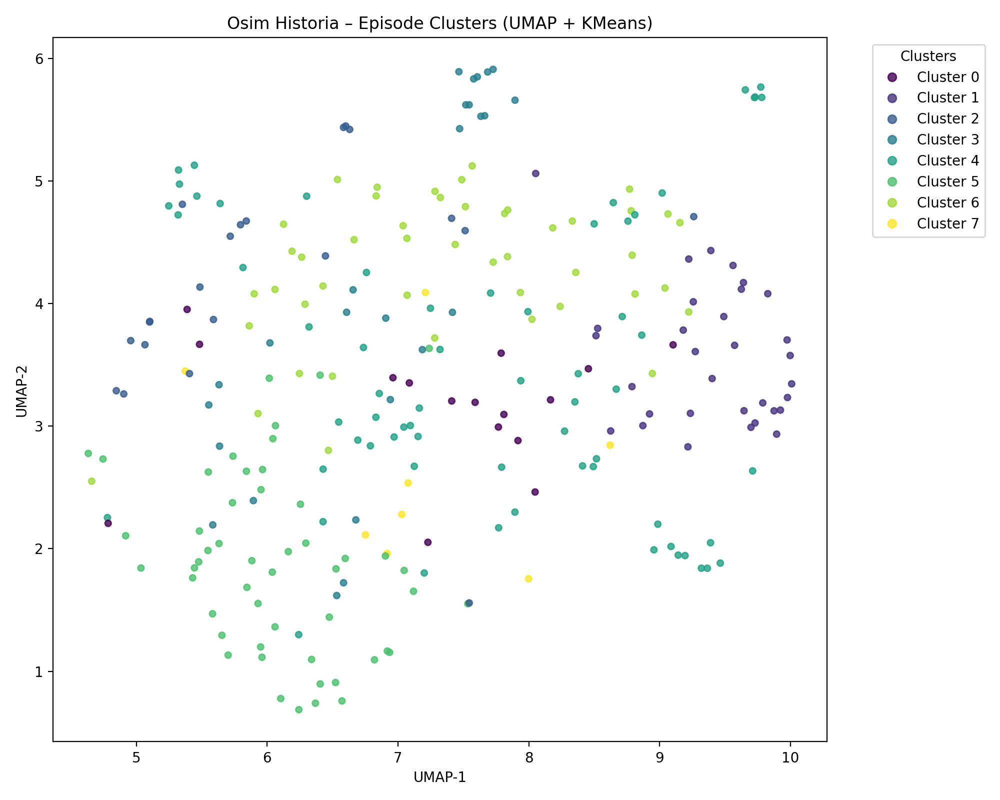

# Osim Historia Podcast – Clustering & Interactive Maps

This project extracts all the episodes tiltels and descriptions from the **"עושים היסטוריה"** podcast RSS feed, cleans the text, generates semantic embeddings with **Azure OpenAI**, clusters them using **KMeans**, and visualizes the results with 2D & 3D **UMAP interactive maps**.

---

### 3D UMAP Map


### 2D UMAP Map



---

## 🚀 Quick Setup

### 1. Create a `.env` file

```env
AZURE_OPENAI_ENDPOINT=<your-endpoint>
AZURE_OPENAI_API_KEY=<your-key>
AZURE_OPENAI_EMBED_DEPLOYMENT=text-embedding-ada-002
```

### 2. Install requirements

```bash
pip install -r requirements.txt
```

### 3. Run the full pipeline

```bash
python run_pipeline.py --rss data/feed.rss --clusters 8
```

To reuse saved data:

```bash
python run_pipeline.py --use-cache
```

---

## 📁 Output Files

* `out/episodes.csv` – cleaned episodes
* `out/embeddings.npy` – embeddings
* `out/episodes_with_clusters.csv` – cluster assignments
* `out/clusters_umap_2d.html` – interactive 2D map
* `out/clusters_umap_3d.html` – interactive 3D map
* `out/cluster_summary.txt` – text‑based summary

---

## 📌 Summary

This project gives you a complete semantic exploration of the **Osim Historia** podcast library: embeddings, clusters, interactive visual maps, and keyword insights—all powered by Azure OpenAI.

Enjoy exploring the podcast in a whole new dimension!
